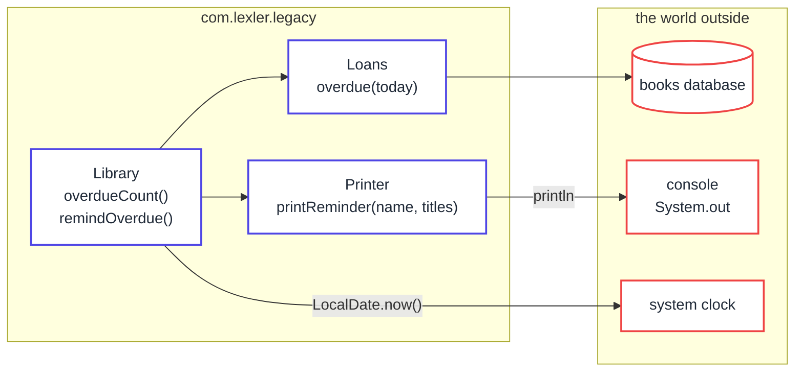
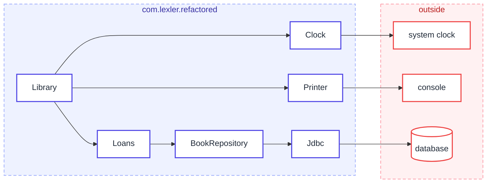

# Legacy - before refactoring

```mermaid
graph LR

    subgraph legacy["com.lexler.legacy"]
        direction LR

        Library["Library<br/>overdueCount()<br/>remindOverdue()"]

        Loans["Loans<br/>overdue(today)"]
        Printer["Printer<br/>printReminder(name, titles)"]

        Library --> Loans
        Library --> Printer
    end

    subgraph outside["the world outside"]
        direction TB

        Database[("books database")]
        Console["console<br/>System.out"]
        Clock["system clock"]
    end

    Loans --> Database
    Printer -->|"println"| Console
    Library -->|"LocalDate.now()"| Clock

    classDef legacyBox fill:#eef2ff,stroke:#6366f1,stroke-width:2px,color:#1e1b4b
    classDef outsideBox fill:#fff1f2,stroke:#ef4444,stroke-width:2px,color:#7f1d1d
    classDef inside fill:#ffffff,stroke:#4f46e5,stroke-width:2px,color:#1f2937
    classDef edge fill:#ffffff,stroke:#ef4444,stroke-width:2px,color:#1f2937

    class Library,Loans,Printer inside
    class Database,Console,Clock edge
```

# Refactored to Nullables

```mermaid
graph LR

    subgraph refactored["com.lexler.refactored"]
        direction TB

        Library["Library"]

        Loans["Loans"]
        BookRepository["BookRepository"]
        Jdbc["Jdbc"]

        Printer["Printer"]
        Clock["Clock"]

        Library --> Loans
        Loans --> BookRepository
        BookRepository --> Jdbc

        Library --> Printer
        Library --> Clock
    end

    subgraph outside["outside"]
        direction TB

        SystemClock["system clock"]
        Console["console"]
        Database[("database")]
    end

    Clock --> SystemClock
    Printer --> Console
    Jdbc --> Database

    classDef inside fill:#ffffff,stroke:#4f46e5,stroke-width:2px,color:#1f2937
    classDef edge fill:#ffffff,stroke:#ef4444,stroke-width:2px,color:#1f2937

    class Library,Loans,BookRepository,Jdbc,Printer,Clock inside
    class SystemClock,Console,Database edge

    style refactored fill:#eef2ff,stroke:#a5b4fc,stroke-width:1.5px,stroke-dasharray:6 4,color:#3730a3
    style outside fill:#fff1f2,stroke:#fda4af,stroke-width:1.5px,stroke-dasharray:6 4,color:#b91c1c
```

